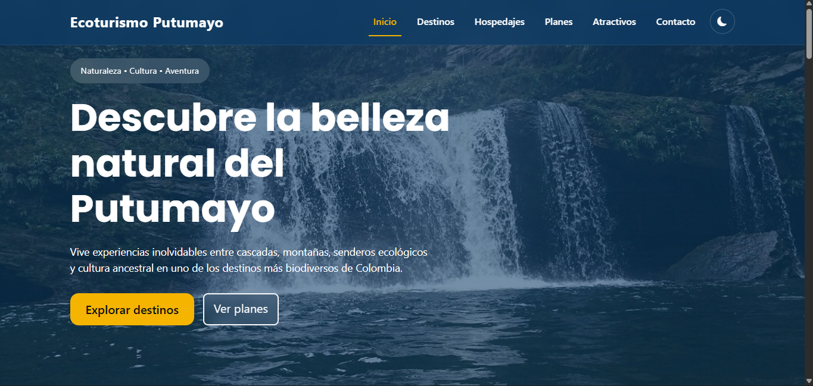

# Ecoturismo Putumayo

Desarrollo y Despliegue de Sitio Web para la organización del Putumayo EcoTurismoPutumamyo

## Descripción

Ecoturismo Putumayo es una propuesta de rediseño inspirada en sitios turísticos reales del departamento, enfocada en ofrecer una mejor experiencia de usuario, diseño moderno y acceso sencillo a información sobre destinos, hospedajes, atractivos y planes turísticos.

## Características

- Diseño responsive (Mobile First)
- Modo oscuro con LocalStorage
- Información turística organizada
- API de clima en tiempo real (OpenWeather)
- Formulario de contacto con validación JavaScript
- Carruseles interactivos
- Acordeones informativos
- Navegación intuitiva
- Diseño moderno con Bootstrap 5

## Tecnologías utilizadas

- HTML5
- CSS3
- Bootstrap 5
- JavaScript Vanilla
- LocalStorage
- OpenWeather API
- Git y GitHub


## Funcionalidades implementadas

### Inicio
- Hero principal
- Destinos destacados
- Hospedajes destacados
- Planes destacados
- Clima actual de Mocoa

### Destinos
- Información de municipios turísticos
- Navegación hacia detalles

### Hospedajes
- Listado de alojamientos
- Carruseles de imágenes

### Planes
- Información de planes turísticos
- Descripción de actividades

### Atractivos
- Información de lugares turísticos
- Galería visual

### Contacto
- Formulario validado con JavaScript
- Preguntas frecuentes

## Instalación

1. Clonar el repositorio

```bash
git clone https://github.com/DeiviDiaz/ecoturismo-putumayo.git
```

2. Abrir la carpeta del proyecto.

3. Ejecutar `index.html` en el navegador.

## Ver pagina



## Integrantes

- Jairo Esneider Trejos Rojas
- Juan Pablo Castro Lopez
- Jhoan Andres Vallejo Arango
- Deivi Paul Diaz Rodriguez

## Estado del proyecto

Proyecto académico desarrollado para la asignatura de Programacion Orientada a la Web.

## Licencia

Uso académico y educativo.
